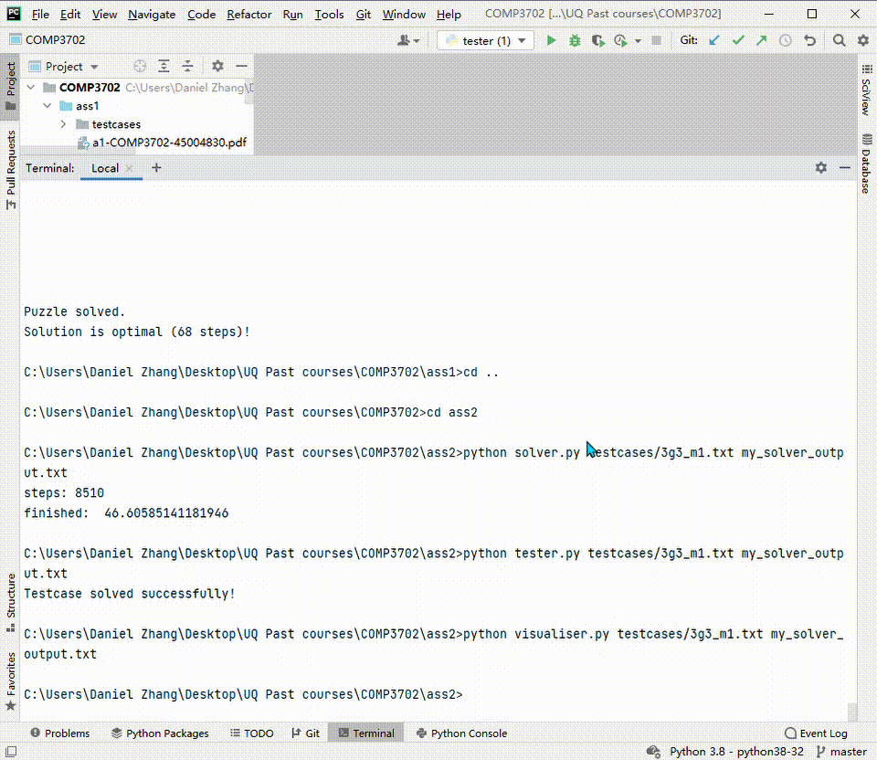
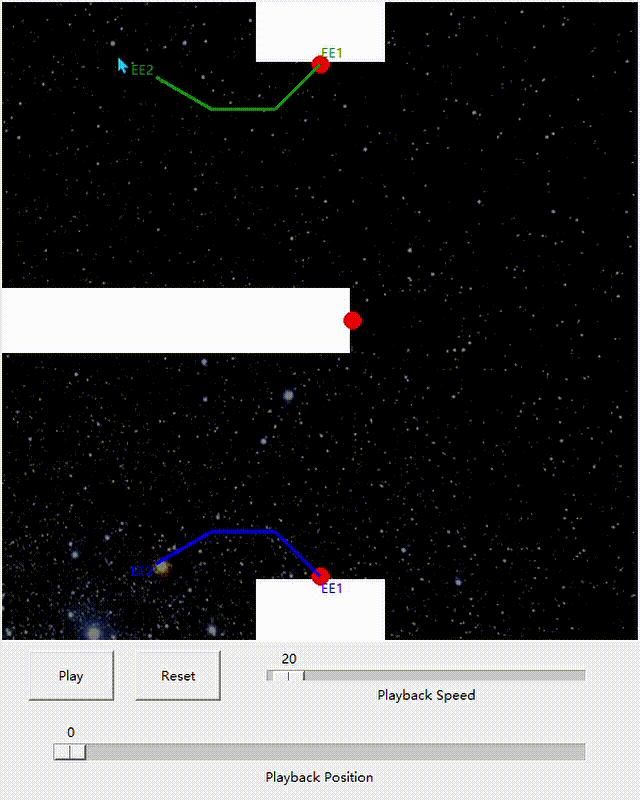

# Artificial-Intelligence
The course aims to introduce the foundational concepts and methods used in the field of artificial intelligence and provide students with skills to apply these techniques. Specifically the course aims to give students an overview of the following topics in artificial intelligence:
- searching for solutions to problems,
- reasoning and planning with certainty, 
- reasoning and planning under uncertainty,
- learning to act, and
- reasoning about other agents.

## [Assignment 1 - LaserTank UCS/A*](https://github.com/danielzhangau/Artificial-Intelligence/tree/master/ass1)
[LaserTank](https://github.com/danielzhangau/Artificial-Intelligence/blob/master/ass1/COMP3702_LaserTank_desc.pdf) is an open source computer puzzle game requiring logical thinking to solve a variety of levels, originally developed by Jim Kindley in 1995. In LaserTank, a player controls a tank vehicle which can move forwards, turn clockwise and counterclockwise, and shoot a laser which can be used to interact with special map elements. The game takes place in a 2D map divided into grid cells. The player must navigate from a starting position to the flag in as few moves as possible while avoiding "game over" conditions. The game is over if the player moves into a dangerous cell (i.e. water cells or any cell in the line of fire area of an anti-tank).  

Our goal is: to turn LaserTank into a search problem, you have will have to first define the following agent design components:
- A problem state representation (state space),
- A successor function that indicates which states can be reached from a given state (action space and transition function), and
- A cost function (utility function); we assume that each step has a uniform cost of 1.

The solver program will: (i) take a testcase filename and an output filename as arguments, (ii) find a solution to the testcase, and (iii) write the solution to an output file with the given output filename.
It will generate a solution in the form of a comma-separated list of actions, taken from the set of move symbols defined in the supplied laser tank.py file, which are:
  - MOVE FORWARD = 'f'
  - TURN LEFT = 'l'
  - TURN RIGHT = 'r'
  - SHOOT LASER = 's'

Best-first search does not estimate how close to goal the current state is, it estimates how close to goal each of the next states will be (from the current state) to influence the path selected.

Uniform-cost search expands the least cost node (regardless of heuristic), and best-first search expands the least (cost + heuristic) node.

- f(n) is the cost function used to evaluate the potential nodes to expand
- g(n) is the cost of moving to a node n
- h(n) is the estimated cost that it will take to get to the final goal state from if we were to go to n
The f(n) used in uniform-cost search
> f(n) = g(n)  

The f(n) used in best-first search (A* is an example of best-first search)  
> f(n) = g(n) + h(n)

Each of these functions is evaluating the potential expansion nodes, not the current node when traversing the tree looking for an n that is a goal state  

  

## [Assignment 2 - Robot arm](https://github.com/danielzhangau/Artificial-Intelligence/tree/master/ass2)
Configuration Space
The robot's configuration space C is the set of all allowed (possible) robot configurations. The dimension is the number of parameter necessary to uniquely specify configuration which depends on the number of segments n because it tells how many rotational joints in the robot. For the robotic arm, we require parameters {eex, eey; -180 < a1 < 180, -165 < a2, …, an < 165, minlength < l1, l2, …, ln < maxlength} to completely specify the position of the arm in the world.  
The free space F ⊆ C is the portion of the free space which is collision-free. The occupied space O ⊆ C is the set of all configurations in which the robot collides either with an obstacle or with itself (self-collision) which made up of obstacle list. The goal of motion planning then, is to find a path in F that connects the initial configuration qstart to the goal configuration qgoal.  

The method I used for searching is Probabilistic Road Maps (PRM). The idea is to take random samples from C, declare them as vertices if in F, try to connect nearby vertices with local planner. We start with uniform sampling to generate sample points in C, then try to make into a robot configuration to determine whether they are valid. If valid and not collides either with an obstacle or with itself, it will be added to the node list. Then the distance between the sample point and other nodes in the list will be checked. When the distance is less than a certain limit, these two nodes will add to each other to become neighbours, indicating that they are connected in the search tree. Repeat this until N samples are created, and then apply a breadth-first search algorithm to find a path from the initial state to the target state. In order to check whether the path between two sample points is valid, the path will be discretised. It will be divided into several smaller segments, and for each segment, verification checks will be applied to ensure that there are no invalid configurations in the path. Verification inspection includes self-collision inspection, obstacle collision inspection and boundary inspection.  
Once the neighbours are connected, we perform a Breath First Search (BFS) algorithm to find a list of configurations that form a path between the initial and the target. In order to meet the requirement that the primitive step is less than 0.001 rad, we need to interpolate between the configurations in the returned list.

  
  

## [Assignment 3 - LaserTank MDP](https://github.com/danielzhangau/Artificial-Intelligence/tree/master/ass3)
some useful learning resources: https://www.youtube.com/watch?v=HEs1ZCvLH2s&ab_channel=stanfordonline Lecture 6,7,8
1. Value Iteration (VI)
2. Policy Iteration (PI)

## [Assignment 4 - LaserTank Q-Learning and SARSA](https://github.com/danielzhangau/Artificial-Intelligence/tree/master/ass4)
some useful learning resources: https://www.youtube.com/watch?v=OkGFJE_XDzI&t=417s&ab_channel=%E8%8E%AB%E7%83%A6Python 莫烦python
1. Q-learning
2. SARSA

## What I have learned:
1.	Describe the core theoretical and conceptual frameworks, methods and practices which form the basis of artificial intelligence.
2.	Explain the properties and functions of a range of different artificial intelligence methods and to be able to connect a method to appropriate theoretical foundations.
3.	Effectively solve problems relating to artificial intelligence topics and applications discussed in class and in the literature.
4.	Implement techniques and methods from artificial intelligence using a high-level programming language.
5.	Effectively formulate real-world problems as problem representations solvable by existing techniques in artificial intelligence.
